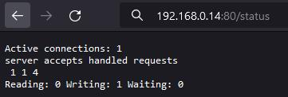

## Part 1. Ready-made docker  
- Take the official docker image from **nginx** and download it using `docker pull`.    
  - `sudo docker pull nginx`      
        
- Check for the docker image with `docker images`.  
  - `sudo docker images`    
         
- Run docker image with `docker run -d [image_id|repository]`.    
  - `sudo docker run -d nginx`  
      
- Check that the image is running with `docker ps`.
  - `sudo docker ps`  
      
- View container information with `docker inspect [container_id|container_name]`.  
  - `sudo docker inspect 0857c411ce9c`  
      
- From the command output define and write in the report the container size, list of mapped ports and container ip.  
  - Size is  1.09kB (virtual 188MB)  
      
  - Mapped ports  
      
  - Container ip  
      
- Stop docker image with `docker stop [container_id|container_name]`.  
   - `sudo docker stop 0857c411ce9c`  
       
- Check that the image has stopped with `docker ps`.  
  - `sudo docker ps`  
      
- Run docker with ports 80 and 443 in container, mapped to the same ports on the local machine, with _run_ command.  
  - `sudo docker run -d -p 80:80 -p 443:443 nginx`  
      
- Check that the **nginx** start page is available in the browser at _localhost:80_.  
  -  
- Restart docker container with `docker restart [container_id|container_name]`.  
  - `sudo docker restart ed28ec89f399`  
      
- Check in any way that the container is running.  
  - `sudo docker ps`  
      
## Part 2. Operations with container  
- Read the _nginx.conf_ configuration file inside the docker container with the _exec_ command.
  - `sudo docker exec silly_hertz cat /etc/nginx/nginx.conf`  
      
- Create a _nginx.conf_ file on a local machine.  
  - `touch nginx.conf`  
      
- Configure it on the _/status_ path to return the **nginx** server status page.  
  - `sudo vim ./nginx.conf`  
      
- Copy the created _nginx.conf_ file inside the docker image using the `docker cp` command.  
  - `sudo docker cp ./nginx.conf silly_hertz:/etc/nginx/nginx.conf`  
      
- Restart **nginx** inside the docker image with _exec_.  
  - `sudo docker exec silly_hertz nginx -s reload`  
      
- Check that _localhost:80/status_ returns the **nginx** server status page.  
  -   
- Export the container to a _container.tar_ file with the _export_ command.
  - `sudo docker export silly_hertz -o container.tar`  
      
- Stop the container.  
  - `sudo docker stop silly_heartz`  
      
- Delete the image with `docker rmi [image_id|repository]`without removing the container first.  
  - `sudo docker rmi -f nginx`  
      
- Delete stopped container.  
  - `sudo docker rm silly_hertz`  
      
- Import the container back using the _import_ command.  
  - `sudo docker import -c 'CMD ["nginx", "-g", "daemon off;"]' ./container.tar nginx`  
      
- Run the imported container.  
  - `sudo docker run -d -p 80:80 -p 443:443 nginx`   
      
- Check that _localhost:80/status_ returns the **nginx** server status page.  
  -     
## Part 3. Mini web server    
- Установим библиотеку `sudo apt-get install libfcgi-dev`  
   -   
- Write a mini server in **C** and **FastCgi** that will return a simple page saying `Hello World!`.   
  -   
  - `gcc server.c -lfcgi -o server`  
      
- Run the written mini server via _spawn-fcgi_ on port 8080.   
  - `sudo spawn-fcgi -p 8080 ./server'`  
    
- Write your own _nginx.conf_ that will proxy all requests from port 81 to _127.0.0.1:8080_.  
  - 
  - Запустим контейнер на порте 81 `sudo docker run -d -p 81:81 nginx`
  - Копируем туда файлы `sudo docker cp nginx.conf beautiful_rosalind:/etc/nginx/` и `sudo docker cp server.c beautiful_rosalind:/home`
  - Запускаем bash в контейнере `sudo docker exec -it beautiful_rosalind bash`
  - Устанавливаем библиотеки и утилиты из контейнера
    - `apt install gcc`
    - `apt install libfcgi-dev`
    - `apt install spawn-fcgi`
  -  Компилируем сервер в контейнере `gcc server.c -lfcgi -o server`
  - Запускаем `spawn-fcgi -p 8080 ./server`
  - Перезагружаем nginx `nginx -s reload`
- Check that browser on _localhost:81_ returns the page you wrote.   
  -   
- Put the _nginx.conf_ file under _./nginx/nginx.conf_ (you will need this later).  

## Part 4. Your own docker
- #### Write your own docker image that:

##### [](#1-builds-mini-server-sources-on-fastcgi-from-part-3)1) builds mini server sources on FastCgi from [Part 3](#part-3-mini-%20web-server);

##### [](#2-runs-it-on-port-8080)2) runs it on port 8080;

##### [](#3-copies-inside-the-image-written-nginxnginxconf)3) copies inside the image written _./nginx/nginx.conf_;

##### [](#4-runs-nginx)4) runs **nginx**.

_**nginx** can be installed inside the docker itself, or you can use a ready-made image with **nginx** as base._  
_When writing a docker image avoid multiple calls of RUN instructions_
- ```docker
		FROM nginx
		WORKDIR /home/
		COPY ./nginx.conf /etc/nginx/nginx.conf
		COPY ./server.c .
		COPY ./run.sh .
		RUN chmod +x run.sh \
		&& apt update \
		&& apt install -y gcc spawn-fcgi libfcgi-dev
		ENTRYPOINT ["./run.sh"] 
	```
- Build the written docker image with `docker build`, specifying the name and tag.
	- `sudo docker build -t custom_image:amber .`
- Check with `docker images` that everything is built correctly.  
	- `sudo docker images`
- Run the built docker image by mapping port 81 to 80 on the local machine and mapping the _./nginx_ folder inside the container to the address where the **nginx** configuration files are located (see Part 2)
	- `sudo docker run -it -p 80:81 -v ./nginx.conf:/etc/nginx/nginx.conf -d custom_image:amber bash`
	- Эта команда Docker запустит контейнер, пробросив порт 81 внутри контейнера на порт 80 на моей машине. Она также подключит файл конфигурации nginx.conf к контейнеру и откроет оболочку bash для взаимодействия.
- Check that the page of the written mini server is available on localhost:80.
	- 
- Add proxying of _/status_ page in _./nginx/nginx.conf_ to return the **nginx** server status.
	- 
- Restart docker image.
	- `sudo docker restart angry_hopper`
- Check that _localhost:80/status_ now returns a page with **nginx** status.
	- 
## Part 5. **Dockle**  
- Apparently my root partition was full (maybe I've tried too many times to download packages through apt), and running `sudo apt clean` solved the issue
- `docker system prune -a` - чтобы очистить ненужные образы
- Устанавливаем Dockle на Ubuntu (команды):
	- ```
		VERSION=$(
		 curl --silent "https://api.github.com/repos/goodwithtech/dockle/releases/latest" | \
		 grep '"tag_name":' | \
		 sed -E 's/.*"v([^"]+)".*/\1/' \
		) && sudo curl -L -o dockle.deb https://github.com/goodwithtech/dockle/releases/download/v${VERSION}/dockle_${VERSION}_Linux-64bit.deb
		$ sudo dpkg -i dockle.deb && rm dockle.deb
		```
- Check the image from the previous task with `dockle [image_id|repository]`.
	- `sudo dockle custom:amber`  
		
- Fix the image so that there are no errors or warnings when checking with **dockle**.
	- Изменим, для этого, dockerfile:  
		  
	- `sudo dockle custom:amber`  
		  
## Part 6. Basic **Docker Compose**
- Write a _docker-compose.yml_ file, using which:

	1) Start the docker container from [Part 5](#part-5-dockle) _(it must work on local network, i.e., you don't need to use **EXPOSE** instruction and map ports to local machine)_.

	2) Start the docker container with **nginx** which will proxy all requests from port 8080 to port 81 of the first container.

	Map port 8080 of the second container to port 80 of the local machine.  
	- docker-compose.yml file:  
		
	- Изменим файл `run.sh` чтобы контейнер не завершал работу после `docker-compose run`  
		  
	- Изменим конфиг `nginx.conf`  чтобы он проксировал все с порта 8080 на порт 81  
		 
- Stop all running containers.
	- `docker stop` и `docker ps`  
		
- Build and run the project with the `docker-compose build` and `docker-compose up` commands.    
	-   
	-   
- Check that the browser returns the page you wrote on _localhost:80_ as before.  
	-   
